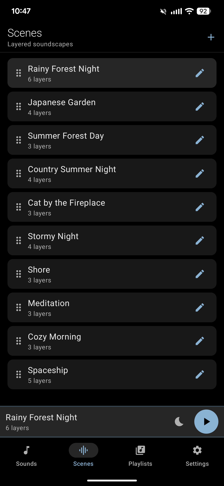
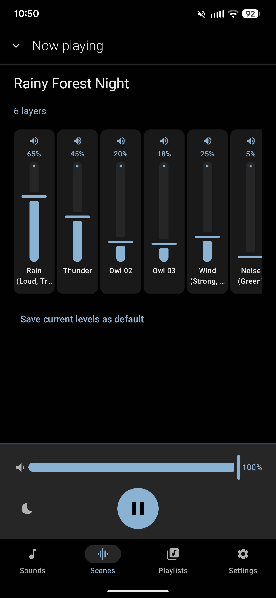
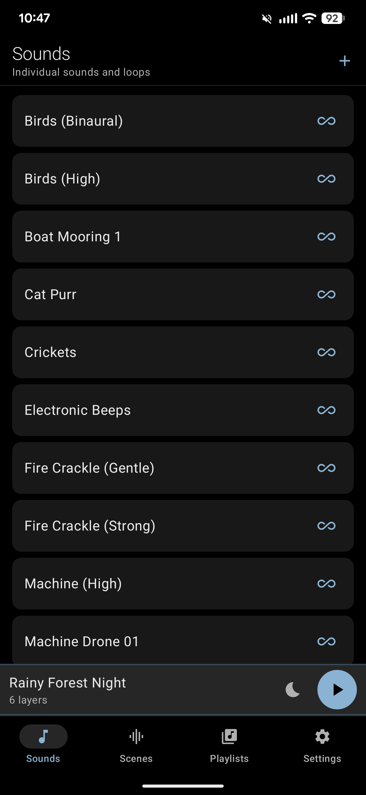

# FreeDrift

A minimal, ad-free Android sleep-sounds app. Plays loopable ambient sounds and multi-layer soundscapes for hours, with a sleep timer and lockscreen controls. No accounts, no ads, no tracking — nothing leaves your phone.

## Features

- **Sounds** — individual loopable clips. Continuous (seamless) or intermittent mode with a tunable silent gap.
- **Scenes** — layered soundscapes (rain + wind + distant thunder, etc.), up to 8 layers, each with its own volume slider. Tweak levels live while playing and save as a default.
- **Playlists** — sequences of sounds or scenes with per-entry duration and crossfade.
- **Sleep timer** — 15 / 30 / 60 / 90 minute presets or custom; fades out gently at the end.
- **Bedside-friendly controls** — big tap-or-long-press play button, optional haptic feedback, and a "keep screen dim while playing" mode.
- **Smart behavior** — pauses when Bluetooth or headphones disconnect, auto-resumes last session on launch, reacts to notifications with a configurable duck-or-pause.
- **Full lockscreen and notification media controls** — play / pause respects the fade you configured.
- **Bring your own sounds** — add `.ogg` / `.mp3` / `.flac` / `.wav` files via the system file picker.
- **Pure-black dark UI**, designed to stay out of the way at 3 AM.

## Screenshots

<p>
  
  
  
</p>

More screens, with annotations, in the [full screenshot tour](docs/SCREENSHOTS.md).

## Install

FreeDrift isn't on Google Play. Install by sideloading the APK:

1. Grab the latest APK from the [Releases](../../releases) page.
2. On your phone, open the downloaded file. Android will ask for permission to install from this source — allow it for your browser or files app.
3. If Play Protect warns the app wasn't scanned, tap **Install anyway**.

Updates are also manual — just install the newer APK on top.

## Privacy

- No ads, ever.
- No tracking, analytics, or telemetry.
- No data collected. Nothing leaves your phone.
- No network permissions at all — the app can't talk to the internet even if it wanted to.

## License

FreeDrift is free software, licensed under the GNU General Public License version 3 or later. See [LICENSE](LICENSE) for the full text.

Bundled sounds are under their respective Creative Commons licenses. The in-app **Settings → Sound credits** screen lists the full attribution for every clip.

## Building from source

The build runs entirely in containers — you only need a Docker-compatible runtime (Colima, Rancher Desktop, OrbStack, Podman with the docker shim, Docker Engine, etc.). The `freedrift` wrapper script does everything else:

```
./freedrift build          # debug APK (fast, unminified)
./freedrift release        # release APK (minified, ~40 MB smaller)
./freedrift run            # build + install + launch on a paired device
./freedrift release-run    # same, but release build
```

Output APKs land in `app/build/outputs/apk/{debug,release}/`.

More detail — pairing a phone, tailing logs, adding your own sounds, changing the package name, and the project layout — is in [`docs/DEVELOPMENT.md`](docs/DEVELOPMENT.md).
