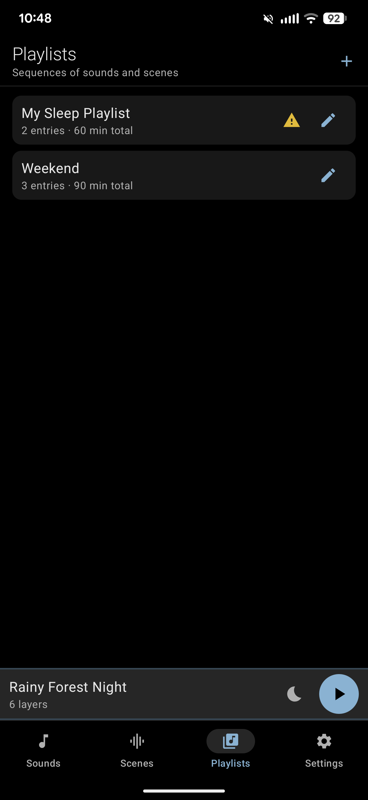
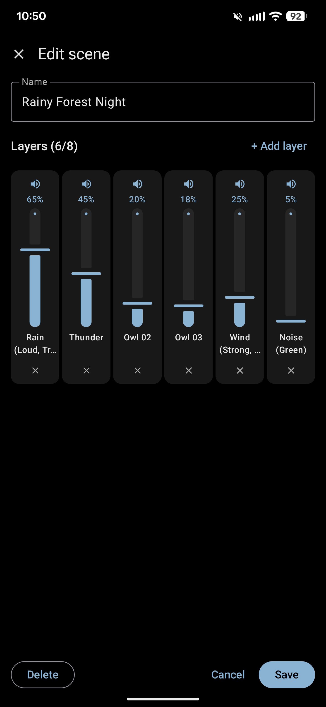
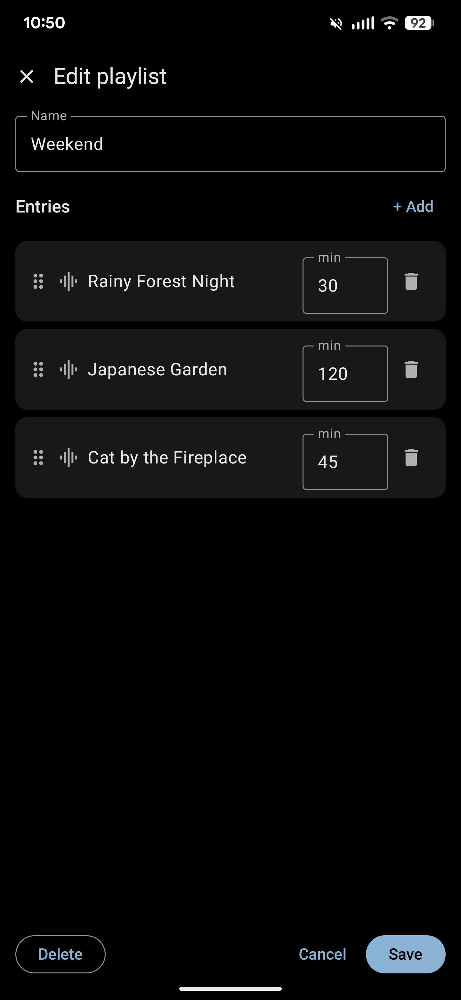
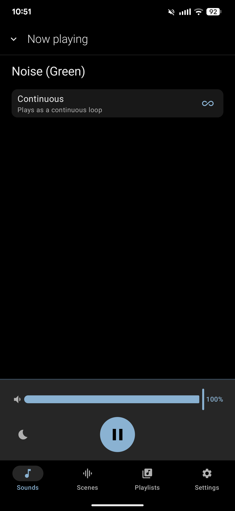
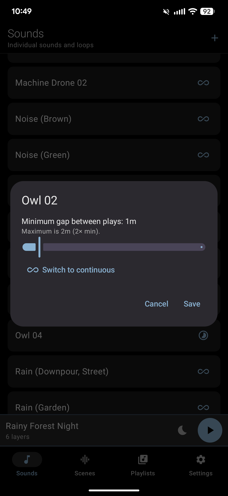
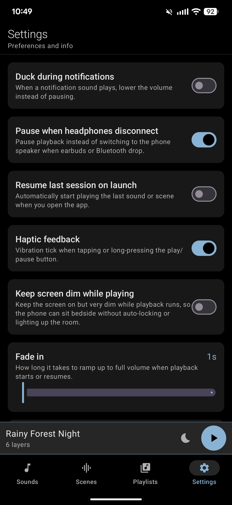
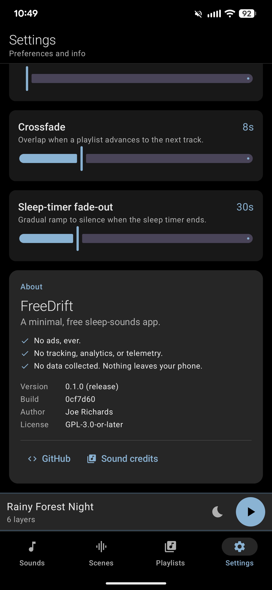

# Screenshots

Full tour of the app's UI surfaces.

## Sounds

The **Sounds** tab is the list of individual loopable clips — the building blocks. Each row has a per-sound mode toggle on the right: the infinity icon means *continuous* (seamless loop), the moon icon means *intermittent* (plays in bursts with a silent gap between). Tap the icon to switch modes; tap it again while intermittent to adjust the gap.

 

## Scenes

**Scenes** are layered soundscapes — up to 8 sounds playing simultaneously, each at its own volume. The list ships with curated starters like "Rainy Forest Night" and "Japanese Garden"; drag the handle on the left to reorder, tap the row to play, tap the pencil to edit.

 

## Playlists

**Playlists** are sequences of sounds or scenes with per-entry durations and crossfades. If an entry points at something that's since been removed, the row shows a yellow warning (see "My Sleep Playlist" above); editing the playlist lets you fix it.

 

## Scene editor

Build or tweak a scene in the **Scene editor**. Each vertical fader is one layer; tap the speaker icon to mute/unmute, long-press the layer name to see the full sound title when it's truncated.

 

## Playlist editor

The **Playlist editor** lists entries with a drag handle, a sound-or-scene icon, the source name, a duration in minutes, and a delete button. Drag entries to reorder.

 

## Now Playing — scene

Swipe up on the mini-player (or tap it) to get the full **Now Playing** view. For a scene it becomes a live mixer: every layer's volume slider is live, so you can tune the soundscape without ever leaving the screen. "Save current levels as default" writes your tweaks back to the scene.

 

## Now Playing — single sound

For an individual sound, Now Playing shows the name, the mode toggle, the app-volume slider, a huge tap-or-long-press play button (long-press stops or restarts from the beginning), and the sleep-timer icon.

 

## Intermittent-mode gap

Tapping the mode icon on an intermittent sound opens the **gap dialog**: minimum gap in seconds between plays. The actual gap randomizes up to 2× the minimum, so multiple intermittent layers don't fall into lockstep.

 

## Settings — behavior toggles

Top of the **Settings** tab: ducking policy, Bluetooth/headphone-disconnect behavior, resume-on-launch, haptic feedback, and screen-dim-while-playing.

 

## Settings — durations and About

Bottom of Settings: configurable fade-in, crossfade, and sleep-timer fade-out durations. The **About** card displays the app version and build, and — importantly — surfaces the app's three core privacy promises front-and-center.

 
